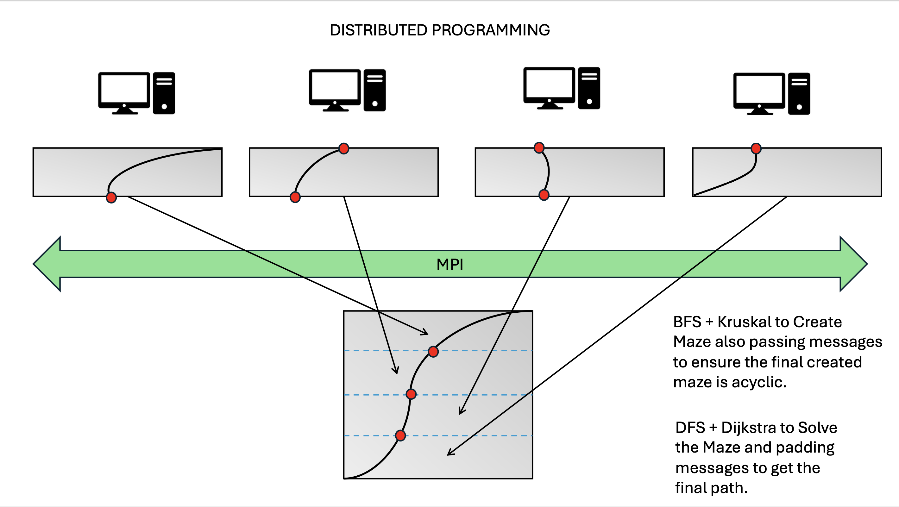

## Compiling Instructions

```
make
```

## Maze Generation and Solving via BFS and DFS

```
mpirun -np 4 ./maze.out -g bfs -s dfs
```

## Maze Generation and Solving via BFS and Dijkstra

```
mpirun -np 4 ./maze.out -g bfs -s dijkstra
```

## Maze Generation and Solving via Kruskal and DFS

```
mpirun -np 4 ./maze.out -g kruskal -s dfs
```

## Maze Generation and Solving via Kruskal and Dijkstra

```
mpirun -np 4 ./maze.out -g kruskal -s dijkstra
```

### A Randomized Ascyclic 0/1 Maze is Generated in src directory for each run


## Overview


